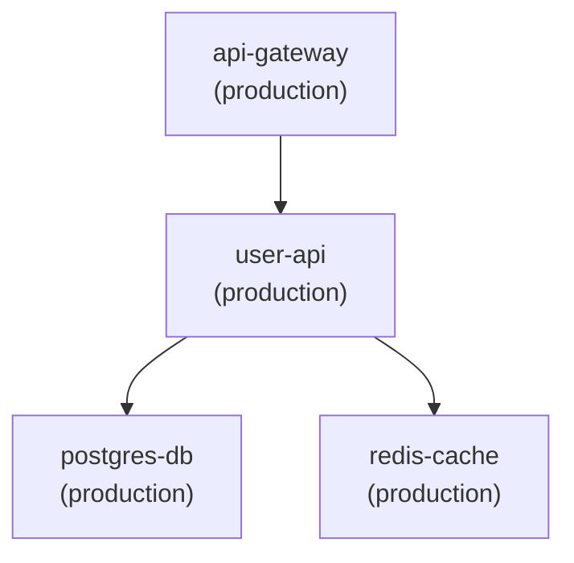

# PMP CLI - Complete Feature Documentation

## Table of Contents

- [Infrastructure Management](#infrastructure-management)
- [Project Management](#project-management)
- [Template Generation](#template-generation)
- [Web UI](#web-ui)
- [CI/CD Pipeline Generation](#cicd-pipeline-generation)
- [Template Management](#template-management)
- [Testing & Validation](#testing--validation)
- [Developer Experience](#developer-experience)
- [Template Pack Management](#template-pack-management)
- [Provider Integration](#provider-integration)
- [Monitoring & Observability](#monitoring--observability)
- [Audit & Compliance](#audit--compliance)
- [State Locking](#state-locking)
- [Code Review](#code-review)
- [Workspace Management](#workspace-management)
- [Backup & Recovery](#backup--recovery)
- [Disaster Recovery](#disaster-recovery)
- [Tagging & Organization](#tagging--organization)
- [Search & Discovery](#search--discovery)

---

## Infrastructure Management

Infrastructure management commands help you create, configure, and manage PMP infrastructures (collections).

### `pmp infrastructure init`

Initialize a new infrastructure in the current directory.

**Basic Usage:**
```bash
# Initialize with default name "My Infrastructure"
pmp infrastructure init

# Initialize with custom name
pmp infrastructure init --name "Production Infrastructure"

# Initialize with name and description
pmp infrastructure init \
  --name "Dev Environment" \
  --description "Development infrastructure for team projects"

# Initialize with custom template packs
pmp infrastructure init \
  --name "Multi-Cloud Platform" \
  --template-packs-paths "/custom/packs:/shared/templates"
```

**What It Does:**
- Creates a `.pmp.infrastructure.yaml` file in the current directory
- Sets up the infrastructure with environments and categories
- Configures template pack paths for project creation
- Establishes the foundation for all project work

**Example Output:**
```yaml
# .pmp.infrastructure.yaml
apiVersion: pmp.io/v1
kind: Infrastructure
metadata:
  name: Production Infrastructure
  description: Main production infrastructure
spec:
  environments:
    dev:
      name: Development
      description: Development environment
    staging:
      name: Staging
      description: Staging environment
    production:
      name: Production
      description: Production environment
  categories:
    - id: kubernetes_workloads
      name: Kubernetes Workloads
      templates:
        - template_pack: microservices
          template: api-service
```

---

### `pmp infrastructure create`

Create a new infrastructure from a pre-built infrastructure template.

**Basic Usage:**
```bash
# Interactive creation (prompts for template selection)
pmp infrastructure create

# Create in specific directory
pmp infrastructure create --output ./new-infra

# Create with custom template packs
pmp infrastructure create \
  --output ./aws-infrastructure \
  --template-packs-paths "/templates/aws:/templates/common"
```

**Use Cases:**
- Quickly scaffold a complete infrastructure setup
- Replicate infrastructure configurations
- Use organization-standard infrastructure templates
- Bootstrap new teams or projects

**Example Workflow:**
```bash
# 1. Create infrastructure from template
pmp infrastructure create --output ./my-platform

# 2. Navigate to the new infrastructure
cd my-platform

# 3. Review the generated configuration
cat .pmp.infrastructure.yaml

# 4. Start creating projects
pmp project create
```

---

### `pmp infrastructure list`

List all infrastructures in the current directory tree.

**Basic Usage:**
```bash
# List all infrastructures
pmp infrastructure list
```

**Example Output:**
```
Found 3 infrastructure(s):

Infrastructure: Production Platform
  Location: /home/user/projects/prod-platform
  Environments: dev, staging, production
  Projects: 15

Infrastructure: Development Sandbox
  Location: /home/user/projects/dev-sandbox
  Environments: dev, test
  Projects: 8

Infrastructure: Legacy Systems
  Location: /home/user/projects/legacy
  Environments: production
  Projects: 23
```

**Use Cases:**
- Find all infrastructure configurations in a workspace
- Get an overview of your infrastructure landscape
- Verify infrastructure locations before operations

---

### `pmp infrastructure switch`

Switch to a different infrastructure (future feature placeholder).

**Basic Usage:**
```bash
# Switch to a named infrastructure
pmp infrastructure switch my-infrastructure
```

**Note:** This command is planned for future implementation to support working with multiple infrastructures in a single workspace.

---

## Project Management

Project management is the core of PMP, allowing you to create, configure, and operate infrastructure-as-code projects.

### `pmp project create`

Create a new project from a template.

**Basic Usage:**
```bash
# Interactive creation (wizard-style prompts)
pmp project create

# Create in specific directory
pmp project create --output ./projects/my-service

# Create with custom template packs
pmp project create \
  --template-packs-paths "/org/templates:/shared/packs"
```

**Interactive Workflow Example:**
```bash
$ pmp project create

Select template pack:
  1. microservices
  2. databases
  3. infrastructure
> 1

Select template:
  1. api-service
  2. worker-service
  3. grpc-service
> 1

Select environment:
  1. dev
  2. staging
  3. production
> 1

Enter project name: user-api
Enter description (optional): User management API service

Enter input values:
  replicas [3]: 2
  image_repository: myorg/user-api
  port [8080]: 8080
  enable_autoscaling [true]: true

✓ Created project: user-api
  Location: ./projects/kubernetes_workload/user-api
  Environment: dev
```

**Project Structure Created:**
```
projects/kubernetes_workload/user-api/
├── .pmp.project.yaml          # Project identifier
└── environments/
    └── dev/
        ├── .pmp.environment.yaml  # Environment configuration
        ├── main.tf                # Generated Terraform/OpenTofu
        ├── variables.tf
        └── outputs.tf
```

**Advanced Examples:**

Create multiple environments:
```bash
# Create for dev
pmp project create

# Later, add staging (using update command)
cd projects/kubernetes_workload/user-api
pmp project update  # Can add new environments
```

---

### `pmp project find`

Find and interact with existing projects.

**Basic Usage:**
```bash
# Interactive find (shows all projects)
pmp project find

# Find by name (substring match, case-insensitive)
pmp project find --name api

# Find by resource kind
pmp project find --kind KubernetesWorkload

# Find by name and kind
pmp project find --name user --kind KubernetesWorkload
```

**Example Output:**
```bash
$ pmp project find --name api

Found 3 project(s):

1. user-api (KubernetesWorkload)
   Description: User management API service
   Environments: dev, staging, production
   Location: projects/kubernetes_workload/user-api

2. payment-api (KubernetesWorkload)
   Description: Payment processing service
   Environments: dev, production
   Location: projects/kubernetes_workload/payment-api

3. api-gateway (KubernetesWorkload)
   Description: Main API gateway
   Environments: dev, staging, production
   Location: projects/kubernetes_workload/api-gateway

Select a project: 1
Select environment: dev

Project: user-api
Environment: dev
Dependencies:
  - postgres-db:dev
  - redis-cache:dev

Inputs:
  replicas: 2
  image_repository: myorg/user-api
  port: 8080
  enable_autoscaling: true
```

**Use Cases:**
- Quickly locate projects in large infrastructures
- Review project configurations before operations
- Navigate to project directories
- Check project dependencies

---

### `pmp project update`

Update an existing project's configuration by regenerating from template.

**Basic Usage:**
```bash
# Update current directory project
pmp project update

# Update specific project
pmp project update --path ./projects/kubernetes_workload/user-api

# Update with custom template packs
pmp project update \
  --path ./projects/kubernetes_workload/user-api \
  --template-packs-paths "/updated/templates"
```

**Interactive Workflow:**
```bash
$ cd projects/kubernetes_workload/user-api/environments/dev
$ pmp project update

Current project: user-api
Environment: dev
Template: microservices/api-service

Current inputs:
  replicas: 2
  image_repository: myorg/user-api
  port: 8080
  enable_autoscaling: true

Update inputs:
  replicas [2]: 5
  image_repository [myorg/user-api]: ↵
  port [8080]: ↵
  enable_autoscaling [true]: ↵

Do you want to add/update plugins? (y/N): y

Available plugins:
  1. postgres/access - Database access credentials
  2. monitoring/prometheus - Prometheus metrics

Select plugin (or press Enter to finish): 1

Plugin: postgres/access
  database_name: users_db
  privileges: ["SELECT", "INSERT", "UPDATE", "DELETE"]

Select plugin (or press Enter to finish): ↵

✓ Updated project configuration
✓ Regenerated infrastructure files

Changes:
  M  main.tf (replicas: 2 → 5)
  A  postgres_access_plugin.tf
```

**Use Cases:**
- Update project configuration without recreating
- Add new plugins to existing projects
- Change template input values
- Regenerate infrastructure code after template updates

---

### `pmp project clone`

Clone an existing project with a new name.

**Basic Usage:**
```bash
# Interactive clone (prompts for source project)
pmp clone new-project-name

# Clone specific project
pmp clone user-api user-api-v2

# Clone with source project selection
pmp clone --source user-api --name user-api-replica

# Clone specific environment only
pmp clone user-api user-api-test --environment dev
```

**Example Workflow:**
```bash
$ pmp project clone user-api payment-api

Cloning project: user-api → payment-api

Select environments to clone:
  [x] dev
  [x] staging
  [ ] production

Clone these environments? (Y/n): y

✓ Cloned dev environment
✓ Cloned staging environment

Created project: payment-api
  Location: projects/kubernetes_workload/payment-api
  Environments: dev, staging

Next steps:
  1. cd projects/kubernetes_workload/payment-api/environments/dev
  2. Update configuration in .pmp.environment.yaml
  3. Run 'pmp project update' to customize inputs
  4. Run 'pmp project preview' to see changes
```

**Use Cases:**
- Create similar services quickly
- Set up project templates for team
- Replicate configurations across environments
- Create test environments from production

---

### `pmp project preview`

Preview infrastructure changes without applying them (runs OpenTofu/Terraform plan).

**Basic Usage:**
```bash
# Preview current directory
pmp project preview

# Preview specific project
pmp project preview --path ./projects/kubernetes_workload/user-api/environments/dev

# Pass additional executor arguments
pmp project preview -- -no-color

# Preview with variables
pmp project preview -- -var=environment=prod -no-color
```

**Example Output:**
```bash
$ cd projects/kubernetes_workload/user-api/environments/dev
$ pmp project preview

Running: tofu plan

OpenTofu will perform the following actions:

  # kubernetes_deployment.app will be updated in-place
  ~ resource "kubernetes_deployment" "app" {
      ~ spec {
          ~ replicas = 2 -> 5

          ~ template {
              ~ spec {
                  ~ container {
                      ~ image = "myorg/user-api:1.0.0" -> "myorg/user-api:1.1.0"
                    }
                }
            }
        }
    }

  # kubernetes_service.app will be created
  + resource "kubernetes_service" "app" {
      + metadata {
          + name      = "user-api"
          + namespace = "default"
        }
      + spec {
          + port {
              + port        = 8080
              + target_port = 8080
            }
        }
    }

Plan: 1 to add, 1 to change, 0 to destroy.
```

**Smart Context Detection:**
```bash
# In environment directory - executes directly
cd projects/kubernetes_workload/user-api/environments/dev
pmp project preview

# In project directory - prompts for environment
cd projects/kubernetes_workload/user-api
pmp project preview
# → Shows: "Select environment: dev, staging, production"

# From anywhere - shows find UI
cd ~/
pmp project preview
# → Interactive project and environment selection
```

**Advanced Examples:**

Preview with dependency handling:
```bash
# Preview shows dependencies will be planned first
$ pmp project preview

Analyzing dependencies...
Found dependencies:
  - postgres-db:dev
  - redis-cache:dev

Planning dependency: postgres-db:dev
OpenTofu plan output...

Planning dependency: redis-cache:dev
OpenTofu plan output...

Planning: user-api:dev
OpenTofu plan output...
```

Preview with additional flags:
```bash
# Detailed output
pmp project preview -- -detailed-exitcode

# Target specific resources
pmp project preview -- -target=kubernetes_deployment.app

# Refresh state before planning
pmp project preview -- -refresh=true
```

---

### `pmp project apply`

Apply infrastructure changes (runs OpenTofu/Terraform apply).

**Basic Usage:**
```bash
# Apply current directory
pmp project apply

# Apply specific project
pmp project apply --path ./projects/kubernetes_workload/user-api/environments/dev

# Pass executor arguments
pmp project apply -- -auto-approve

# Apply with variables
pmp project apply -- -var=environment=prod -auto-approve
```

**Example Workflow:**
```bash
$ cd projects/kubernetes_workload/user-api/environments/dev

# 1. Preview changes first
$ pmp project preview
Plan: 2 to add, 1 to change, 0 to destroy.

# 2. Apply changes (with confirmation)
$ pmp project apply

Do you want to apply these changes? (yes/no): yes

Applying changes...

kubernetes_deployment.app: Modifying... [id=default/user-api]
kubernetes_deployment.app: Modifications complete after 5s
kubernetes_service.app: Creating... [id=default/user-api-service]
kubernetes_service.app: Creation complete after 2s

Apply complete! Resources: 1 added, 1 changed, 0 destroyed.

Outputs:
service_endpoint = "http://user-api.default.svc.cluster.local:8080"
```

**Dependency Handling:**
```bash
$ pmp project apply

Analyzing dependencies...
Dependencies will be applied in this order:
  1. postgres-db:dev
  2. redis-cache:dev
  3. user-api:dev

Apply dependencies? (y/N): y

[1/3] Applying postgres-db:dev...
✓ Complete

[2/3] Applying redis-cache:dev...
✓ Complete

[3/3] Applying user-api:dev...
✓ Complete

All changes applied successfully!
```

**Advanced Examples:**

Auto-approve (CI/CD):
```bash
pmp project apply -- -auto-approve
```

Apply with parallelism:
```bash
pmp project apply -- -parallelism=10
```

Apply specific resource:
```bash
pmp project apply -- -target=kubernetes_deployment.app
```

---

### `pmp project destroy`

Destroy infrastructure managed by a project.

**Basic Usage:**
```bash
# Destroy with confirmation prompt
pmp project destroy

# Destroy specific project
pmp project destroy --path ./projects/kubernetes_workload/user-api/environments/dev

# Skip confirmation (dangerous!)
pmp project destroy --yes

# Destroy with executor arguments
pmp project destroy --yes -- -auto-approve

# Destroy with parallelism
pmp project destroy --yes -- -parallelism=10
```

**Example with Safety Confirmation:**
```bash
$ cd projects/kubernetes_workload/user-api/environments/dev
$ pmp project destroy

⚠️  WARNING: This will destroy all resources managed by this project!

Project: user-api
Environment: dev
Resources to destroy:
  - kubernetes_deployment.app
  - kubernetes_service.app
  - kubernetes_configmap.config
  - kubernetes_secret.credentials

Type the project name to confirm: user-api

Are you absolutely sure? (yes/no): yes

Destroying resources...

kubernetes_service.app: Destroying... [id=default/user-api-service]
kubernetes_service.app: Destruction complete after 2s
kubernetes_deployment.app: Destroying... [id=default/user-api]
kubernetes_deployment.app: Destruction complete after 15s
kubernetes_secret.credentials: Destroying...
kubernetes_secret.credentials: Destruction complete after 1s
kubernetes_configmap.config: Destroying...
kubernetes_configmap.config: Destruction complete after 1s

Destroy complete! Resources: 4 destroyed.
```

**Dependency-Aware Destruction:**
```bash
$ pmp project destroy --yes

⚠️  Warning: Other projects depend on this project!

Dependents:
  - user-api:dev
  - order-service:dev

Destroy anyway? (yes/no): no

Destruction cancelled.
```

---

### `pmp project refresh`

Refresh infrastructure state without modifying resources.

**Basic Usage:**
```bash
# Refresh current directory
pmp project refresh

# Refresh specific project
pmp project refresh --path ./projects/kubernetes_workload/user-api/environments/dev

# Refresh with executor arguments
pmp project refresh -- -var=environment=prod
```

**Example Usage:**
```bash
$ pmp project refresh

Refreshing state...

kubernetes_deployment.app: Refreshing state... [id=default/user-api]
kubernetes_service.app: Refreshing state... [id=default/user-api-service]
kubernetes_configmap.config: Refreshing state... [id=default/user-api-config]

Refresh complete!

Changes detected:
  - kubernetes_deployment.app: replicas changed (2 → 3) externally
  - kubernetes_service.app: no changes
  - kubernetes_configmap.config: new annotation added externally

State has been updated to reflect the current infrastructure.
```

**Use Cases:**
- Update state after manual changes
- Sync state with actual infrastructure
- Detect drift before planning
- Update state after external modifications

---

### `pmp project graph`

Visualize project dependency graphs.

**Basic Usage:**
```bash
# Show dependency graph for current project
pmp project graph

# Show all projects in infrastructure
pmp project graph --all

# Export to Mermaid format
pmp project graph --format mermaid --output graph.mmd

# Export to GraphViz DOT format
pmp project graph --format dot --output graph.dot

# Export from specific project
pmp project graph --path ./projects/kubernetes_workload/user-api --format mermaid
```

**ASCII Output Example:**
```bash
$ pmp project graph --all

Dependency Graph:

api-gateway:production
├─ user-api:production
│  ├─ postgres-db:production
│  └─ redis-cache:production
├─ order-service:production
│  ├─ postgres-db:production
│  └─ rabbitmq:production
└─ payment-api:production
   └─ postgres-db:production

Deployment Order (topological sort):
  1. postgres-db:production
  2. redis-cache:production, rabbitmq:production
  3. user-api:production, order-service:production, payment-api:production
  4. api-gateway:production
```

**Mermaid Output Example:**
```bash
$ pmp project graph --format mermaid --output infrastructure.mmd

✓ Generated: infrastructure.mmd

$ cat infrastructure.mmd
```



**GraphViz DOT Output Example:**
```bash
$ pmp project graph --format dot --output deps.dot

✓ Generated: deps.dot

# Render with Graphviz
$ dot -Tpng deps.dot -o deps.png
```

**Use Cases:**
- Understand system architecture
- Plan deployment order
- Document dependencies for team
- Identify circular dependencies
- Visualize infrastructure relationships

---

### `pmp project deps`

Analyze and manage project dependencies.

#### `pmp project deps analyze`

Comprehensive dependency analysis.

**Basic Usage:**
```bash
# Analyze all dependencies
pmp project deps analyze

# Analyze with JSON format
pmp project deps analyze --format json
```

**Example Output:**
```bash
$ pmp project deps analyze

Dependency Analysis
═══════════════════

Summary:
  Total Projects: 15
  Projects with Dependencies: 8
  Standalone Projects: 7
  Max Dependency Depth: 3

Health Checks:
  ✓ No circular dependencies detected
  ✓ No missing dependencies
  ✓ All dependency references valid

Dependency Bottlenecks:
  postgres-db:production    ← 5 project(s) depend on this
  redis-cache:production    ← 3 project(s) depend on this
  rabbitmq:production       ← 2 project(s) depend on this

Dependency Chains:
  Depth 3:
    api-gateway → user-api → postgres-db
    api-gateway → order-service → postgres-db

  Depth 2:
    user-api → redis-cache
    order-service → rabbitmq

  Depth 1:
    payment-api → postgres-db

Standalone Projects:
  • monitoring:dev
  • logging:dev
  • backup-service:production
  • metrics-collector:production
  • alert-manager:production
  • cost-analyzer:dev
  • documentation:dev

Recommendations:
  ⚠ Consider adding redundancy for postgres-db:production (5 dependents)
  💡 monitoring:dev could be integrated with other projects
  ✓ Good dependency distribution overall
```

#### `pmp project deps impact`

Show impact of changes to a project.

**Basic Usage:**
```bash
# Show what would be affected by changes
pmp project deps impact postgres-db
```

**Example Output:**
```bash
$ pmp project deps impact postgres-db

Impact Analysis: postgres-db:production

Direct Dependents (5):
  • user-api:production
  • order-service:production
  • payment-api:production
  • inventory-service:production
  • analytics-service:production

Indirect Dependents (2):
  • api-gateway:production (via user-api:production)
  • admin-portal:production (via order-service:production)

Total Affected Projects: 7

Blast Radius:
  ██████████████████████████████ 46.7% of infrastructure

Deployment Impact:
  If postgres-db:production is modified, these projects need consideration:

  Must Review:
    ✓ user-api:production (direct dependency)
    ✓ order-service:production (direct dependency)
    ✓ payment-api:production (direct dependency)

  May Need Update:
    ⚠ api-gateway:production (indirect via user-api)
    ⚠ admin-portal:production (indirect via order-service)

Recommended Actions:
  1. Run 'pmp project preview' on all direct dependents
  2. Check for breaking changes in outputs
  3. Update dependents if necessary
  4. Test in dev/staging before production
```

#### `pmp project deps why`

Explain why a project is needed.

**Basic Usage:**
```bash
# Explain why a project exists
pmp project deps why user-api
```

**Example Output:**
```bash
$ pmp project deps why user-api

Why is user-api:production needed?

Required By:
  1. api-gateway:production
     └─ Provides: User authentication and management endpoints
     └─ Uses outputs: service_endpoint, api_key

  2. admin-portal:production
     └─ Provides: User administration interface
     └─ Uses outputs: service_endpoint

Dependency Chain:
  frontend-app:production
    └─ api-gateway:production
       └─ user-api:production
          ├─ postgres-db:production
          └─ redis-cache:production

Critical Path: Yes
  ⚠ This project is on the critical path for:
    - frontend-app:production
    - admin-portal:production

Impact if Removed:
  ✗ 2 projects would break
  ✗ 1 critical user-facing service affected
  ⚠ Removal not recommended
```

---

### `pmp project drift`

Detect and manage infrastructure drift.

#### `pmp project drift detect`

Detect configuration drift.

**Basic Usage:**
```bash
# Detect drift for current project
pmp project drift detect

# Detect drift for specific project
pmp project drift detect --path ./projects/kubernetes_workload/user-api/environments/dev

# Output in JSON format
pmp project drift detect --format json
```

**Example Output:**
```bash
$ pmp project drift detect

Drift Detection Report
════════════════════════

Project: user-api
Environment: dev
Last Applied: 2025-01-15 10:30:00 UTC

Checking for drift...

⚠ Drift Detected!

Changes detected in 3 resource(s):

1. kubernetes_deployment.app
   ~ replicas: 3 → 5 (manual change)
   ~ image: "myorg/user-api:1.0.0" → "myorg/user-api:1.0.1" (manual update)

2. kubernetes_service.app
   ~ annotations: added "monitoring.io/scrape: true" (external modification)

3. kubernetes_configmap.config
   ~ data.LOG_LEVEL: "info" → "debug" (manual change)

Summary:
  Total Resources: 8
  Drifted Resources: 3
  Drift Percentage: 37.5%

Recommendations:
  • Run 'pmp project drift reconcile' to align with desired state
  • Or run 'pmp project update' to update configuration to match current state
  • Review changes before reconciliation
```

#### `pmp project drift report`

Generate detailed drift report.

**Basic Usage:**
```bash
# Generate report for current project
pmp project drift report

# Generate report with output file
pmp project drift report --output drift-report.txt

# Generate JSON report
pmp project drift report --format json --output drift.json
```

**Example Report:**
```bash
$ pmp project drift report --output report.md

✓ Generated drift report: report.md
```

```markdown
# Drift Report: user-api (dev)

**Generated:** 2025-01-15 14:30:00 UTC
**Last Applied:** 2025-01-15 10:30:00 UTC
**Time Since Last Apply:** 4 hours

## Summary

- Total Resources: 8
- Resources with Drift: 3
- Resources without Drift: 5
- Drift Percentage: 37.5%

## Detailed Changes

### kubernetes_deployment.app

**Status:** DRIFTED

| Attribute | Expected | Actual | Change |
|-----------|----------|--------|--------|
| replicas | 3 | 5 | Manual scaling |
| image | myorg/user-api:1.0.0 | myorg/user-api:1.0.1 | Manual update |

**Impact:** Medium
**Recommendations:**
- Verify if manual changes should be permanent
- Update configuration if scaling is intentional
- Review image update for compatibility

### kubernetes_service.app

**Status:** DRIFTED

| Attribute | Expected | Actual | Change |
|-----------|----------|--------|--------|
| annotations | {} | {monitoring.io/scrape: "true"} | External tool |

**Impact:** Low
**Recommendations:**
- Accept change if monitoring is desired
- Add annotation to configuration

### kubernetes_configmap.config

**Status:** DRIFTED

| Attribute | Expected | Actual | Change |
|-----------|----------|--------|--------|
| data.LOG_LEVEL | info | debug | Manual change |

**Impact:** Low (DEBUG logging may affect performance)
**Recommendations:**
- Revert to 'info' for production
- Use 'debug' only for troubleshooting

## Resources Without Drift

- kubernetes_secret.credentials ✓
- kubernetes_horizontal_pod_autoscaler.app ✓
- kubernetes_ingress.app ✓
- kubernetes_service_account.app ✓
- kubernetes_role_binding.app ✓
```

#### `pmp project drift reconcile`

Reconcile drift with desired state.

**Basic Usage:**
```bash
# Reconcile with confirmation
pmp project drift reconcile

# Reconcile specific project
pmp project drift reconcile --path ./projects/kubernetes_workload/user-api/environments/dev

# Auto-approve reconciliation (dangerous!)
pmp project drift reconcile --auto-approve
```

**Example Workflow:**
```bash
$ pmp project drift reconcile

Drift Reconciliation
══════════════════

Project: user-api
Environment: dev

Detected Changes:
  ~ kubernetes_deployment.app (2 attributes changed)
  ~ kubernetes_service.app (1 attribute changed)
  ~ kubernetes_configmap.config (1 attribute changed)

⚠ Reconciliation will:
  • Revert manual changes
  • Restore desired state from configuration
  • May cause service disruption

Show detailed changes? (Y/n): y

Detailed Changes:

  kubernetes_deployment.app:
    replicas: 5 → 3 (revert to configured value)
    image: myorg/user-api:1.0.1 → myorg/user-api:1.0.0 (revert to configured value)

  kubernetes_service.app:
    annotations: remove "monitoring.io/scrape: true"

  kubernetes_configmap.config:
    data.LOG_LEVEL: debug → info (revert to configured value)

Proceed with reconciliation? (yes/no): yes

Reconciling...

kubernetes_configmap.config: Updating...
kubernetes_configmap.config: Update complete after 1s

kubernetes_service.app: Updating...
kubernetes_service.app: Update complete after 2s

kubernetes_deployment.app: Updating...
kubernetes_deployment.app: Rolling out new pods...
kubernetes_deployment.app: Update complete after 30s

✓ Reconciliation complete!

Resources restored to desired state.
```

---

### `pmp project policy`

Validate infrastructure against policies.

#### `pmp project policy validate`

Validate against specific policy.

**Basic Usage:**
```bash
# Validate current project
pmp project policy validate

# Validate specific project
pmp project policy validate --path ./projects/kubernetes_workload/user-api/environments/dev

# Validate with specific policy
pmp project policy validate --policy security-baseline
```

**Example Output:**
```bash
$ pmp project policy validate --policy security-baseline

Policy Validation: security-baseline
═══════════════════════════════════

Project: user-api
Environment: dev

Validating 15 policy rules...

✓ PASSED: Containers must not run as root
✓ PASSED: Resource limits must be defined
✗ FAILED: Images must be from approved registries
  → Image 'myorg/user-api:1.0.0' from unapproved registry
  → Approved registries: gcr.io/*, docker.io/library/*

✓ PASSED: Secrets must not be embedded in code
✗ FAILED: Network policies must be defined
  → No network policy found for namespace 'default'

✓ PASSED: Service accounts must be explicitly defined
✓ PASSED: Ingress must use TLS
⚠ WARNING: Liveness probes recommended
  → No liveness probe defined for container 'app'

Results:
  Passed: 5/8
  Failed: 2/8
  Warnings: 1/8

Overall: FAILED

Remediation:
  1. Update image to use approved registry
  2. Add network policy for namespace
  3. Add liveness probe to deployment
```

#### `pmp project policy scan`

Scan for all policy violations.

**Basic Usage:**
```bash
# Scan current project
pmp project policy scan

# Scan specific project
pmp project policy scan --path ./projects/kubernetes_workload/user-api/environments/dev

# Filter by severity
pmp project policy scan --severity high
```

**Example Output:**
```bash
$ pmp project policy scan

Policy Scan Results
═══════════════════

Project: user-api
Environment: dev

Scanning against all policies...

Critical Issues (2):
  ✗ Secrets stored in environment variables
    Location: kubernetes_deployment.app.spec.template.spec.containers[0].env
    Impact: High - Credentials exposed in pod spec
    Remediation: Use Kubernetes secrets with secret refs

  ✗ Privileged container detected
    Location: kubernetes_deployment.app.spec.template.spec.containers[0].securityContext
    Impact: Critical - Container can access host resources
    Remediation: Remove privileged: true

High Severity (3):
  ✗ No resource limits defined
    Location: kubernetes_deployment.app.spec.template.spec.containers[0]
    Impact: High - Pod can consume unlimited resources
    Remediation: Add resources.limits.memory and resources.limits.cpu

  ✗ Container runs as root
    Location: kubernetes_deployment.app.spec.template.spec.containers[0].securityContext
    Impact: High - Security risk
    Remediation: Add runAsNonRoot: true

  ✗ Host network mode enabled
    Location: kubernetes_deployment.app.spec.template.spec
    Impact: High - Bypasses network isolation
    Remediation: Remove hostNetwork: true

Medium Severity (5):
  ⚠ No readiness probe defined
  ⚠ No liveness probe defined
  ⚠ Default service account used
  ⚠ No pod security policy referenced
  ⚠ Ingress missing rate limiting

Low Severity (3):
  ℹ No pod disruption budget defined
  ℹ No horizontal pod autoscaler configured
  ℹ Deployment missing recommended labels

Summary:
  Critical: 2
  High: 3
  Medium: 5
  Low: 3

  Total Issues: 13
  Policy Compliance: 47%

Recommendations:
  1. Address all critical issues immediately
  2. Fix high severity issues before production
  3. Review medium severity issues
  4. Consider low severity improvements
```

---

### `pmp project state`

Manage infrastructure state.

#### `pmp project state list`

List state across all projects.

**Basic Usage:**
```bash
# List all state
pmp project state list

# List with details
pmp project state list --details

# List in JSON format
pmp project state list --format json
```

**Example Output:**
```bash
$ pmp project state list --details

Infrastructure State Overview
═══════════════════════════════

Total Projects: 15
Total Environments: 28
State Files: 28

┌─────────────────────┬─────────────┬───────────┬──────────────────────┬────────┐
│ Project             │ Environment │ Resources │ Last Modified        │ Locked │
├─────────────────────┼─────────────┼───────────┼──────────────────────┼────────┤
│ user-api            │ dev         │ 8         │ 2025-01-15 14:30:00  │ No     │
│ user-api            │ staging     │ 8         │ 2025-01-15 12:00:00  │ No     │
│ user-api            │ production  │ 10        │ 2025-01-15 10:00:00  │ Yes    │
│ postgres-db         │ dev         │ 5         │ 2025-01-14 16:00:00  │ No     │
│ postgres-db         │ production  │ 6         │ 2025-01-13 09:00:00  │ Yes    │
│ redis-cache         │ dev         │ 3         │ 2025-01-15 15:00:00  │ No     │
│ api-gateway         │ production  │ 12        │ 2025-01-15 11:00:00  │ No     │
└─────────────────────┴─────────────┴───────────┴──────────────────────┴────────┘

Locked Projects (2):
  • user-api:production (locked by alice@example.com, 4 hours ago)
    Reason: Performing hotfix deployment

  • postgres-db:production (locked by system, 2 days ago)
    Reason: Scheduled maintenance

Recently Modified (< 1 hour):
  • redis-cache:dev (15 minutes ago)
  • user-api:dev (30 minutes ago)

Warnings:
  ⚠ user-api:production locked for 4+ hours
  ⚠ postgres-db:production locked for 2+ days (stale lock?)
```

#### `pmp project state drift`

Detect state drift.

**Basic Usage:**
```bash
# Check drift for all projects
pmp project state drift

# Check drift for specific project
pmp project state drift --project user-api
```

**Example Output:**
```bash
$ pmp project state drift

State Drift Detection
═══════════════════════

Checking 15 projects...

Projects with Drift (3):

  user-api:dev
    ⚠ 3 resources modified externally
    Last check: 5 minutes ago

  postgres-db:production
    ⚠ 1 resource modified externally
    Last check: 10 minutes ago

  redis-cache:dev
    ⚠ 2 resources modified externally
    Last check: 2 minutes ago

Projects without Drift (12):
  ✓ user-api:staging
  ✓ user-api:production
  ✓ api-gateway:production
  ✓ ...

Summary:
  Total: 15
  With Drift: 3 (20%)
  No Drift: 12 (80%)

Recommendations:
  • Run 'pmp project drift detect --path <project>' for details
  • Use 'pmp project drift reconcile' to fix drift
```

#### `pmp project state lock`

Lock state for a project.

**Basic Usage:**
```bash
# Lock project (requires selection)
pmp project state lock --project user-api

# Lock with reason
pmp project state lock --project user-api --reason "Hotfix deployment in progress"
```

**Example:**
```bash
$ pmp project state lock --project postgres-db --reason "Database migration"

Select environment:
  1. dev
  2. production
> 2

Locking state for postgres-db:production...

✓ State locked successfully

Lock Information:
  Project: postgres-db:production
  Locked by: alice@workstation.local
  Lock ID: 8f7d6c5b-4e3a-2f1b-9c8d-7e6f5a4b3c2d
  Reason: Database migration
  Timestamp: 2025-01-15 14:45:00 UTC

⚠ Remember to unlock when finished:
  pmp project state unlock --project postgres-db
```

#### `pmp project state unlock`

Unlock state for a project.

**Basic Usage:**
```bash
# Unlock project
pmp project state unlock --project user-api

# Force unlock (if not owner)
pmp project state unlock --project user-api --force
```

**Example:**
```bash
$ pmp project state unlock --project postgres-db

Select environment:
  1. dev
  2. production
> 2

Current lock:
  Locked by: alice@workstation.local
  Lock ID: 8f7d6c5b-4e3a-2f1b-9c8d-7e6f5a4b3c2d
  Reason: Database migration
  Duration: 15 minutes

Unlock state? (y/N): y

✓ State unlocked successfully
```

**Force Unlock Example:**
```bash
$ pmp project state unlock --project postgres-db --force

⚠ WARNING: Force unlock will remove lock owned by another user!

Current lock:
  Locked by: bob@other-workstation.local
  Reason: Maintenance window
  Duration: 2 days 3 hours

This lock appears stale. Force unlock? (yes/no): yes

✓ State forcibly unlocked

⚠ The original lock owner should be notified
```

#### `pmp project state backup`

Backup state file.

**Basic Usage:**
```bash
# Backup project state
pmp project state backup --project user-api

# Backup with custom path
pmp project state backup --project user-api --path ./backups
```

**Example:**
```bash
$ pmp project state backup --project user-api

Select environment:
  1. dev
  2. staging
  3. production
> 3

Creating state backup...

✓ Backup created successfully

Backup Information:
  File: user-api_production_state_20250115_144500.tfstate
  Location: .backups/state/
  Size: 145 KB
  Resources: 10

Backup can be restored with:
  pmp project state restore --backup-id user-api_production_state_20250115_144500
```

#### `pmp project state restore`

Restore state from backup.

**Basic Usage:**
```bash
# Restore from backup
pmp project state restore --backup-id user-api_production_state_20250115_144500

# Restore with force (skip confirmation)
pmp project state restore --backup-id user-api_production_state_20250115_144500 --force

# Restore to custom path
pmp project state restore --backup-id user-api_production_state_20250115_144500 --path ./custom
```

**Example:**
```bash
$ pmp project state restore --backup-id user-api_production_state_20250115_144500

⚠ WARNING: This will replace the current state file!

Backup Information:
  Created: 2025-01-15 14:45:00 UTC
  Project: user-api:production
  Resources: 10
  Size: 145 KB

Current State:
  Last Modified: 2025-01-15 16:30:00 UTC
  Resources: 8
  Size: 132 KB

⚠ Current state has 2 fewer resources!

Create backup of current state before restore? (Y/n): y

Creating safety backup...
✓ Safety backup: user-api_production_state_20250115_163000_pre_restore.tfstate

Restore from backup? (yes/no): yes

Restoring state...
✓ State restored successfully

Restoration complete:
  Previous state backed up to: .backups/state/user-api_production_state_20250115_163000_pre_restore.tfstate
  State file restored from: user-api_production_state_20250115_144500.tfstate
```

#### `pmp project state migrate`

Migrate state backend.

**Basic Usage:**
```bash
# Migrate to different backend
pmp project state migrate --backend-type s3

# Migrate specific project
pmp project state migrate --backend-type s3 --path ./projects/kubernetes_workload/user-api/environments/dev
```

**Example:**
```bash
$ pmp project state migrate --backend-type s3

State Backend Migration
═══════════════════════

Current Backend: local
Target Backend: s3

Project: user-api
Environment: production

Enter S3 configuration:
  Bucket: my-terraform-state
  Key prefix: pmp/user-api/production
  Region: us-west-2
  Encrypt: (Y/n): y
  DynamoDB table (for locking): terraform-locks

Configuration Summary:
  backend "s3" {
    bucket         = "my-terraform-state"
    key            = "pmp/user-api/production/terraform.tfstate"
    region         = "us-west-2"
    encrypt        = true
    dynamodb_table = "terraform-locks"
  }

Migrate state? (Y/n): y

Step 1: Initializing new backend...
✓ Backend initialized

Step 2: Copying state to new backend...
✓ State copied (145 KB)

Step 3: Verifying migration...
✓ State verified on new backend

Step 4: Cleaning up old state...
Old state backed up to: .backups/state/user-api_production_local_20250115_164500.tfstate

✓ Migration complete!

The project now uses S3 backend for state storage.
```

---

### `pmp project env`

Manage and compare environments.

#### `pmp project env diff`

Compare two environments.

**Basic Usage:**
```bash
# Compare dev and staging
pmp project env diff dev staging

# Compare staging and production
pmp project env diff staging production
```

**Example Output:**
```bash
$ pmp project env diff dev production

Environment Comparison: dev ↔ production
═══════════════════════════════════════

Infrastructure: Production Platform
Projects Found: 12

Comparing projects with both environments...

┌──────────────────┬───────────────────┬──────────┬────────────┐
│ Project          │ Input             │ dev      │ production │
├──────────────────┼───────────────────┼──────────┼────────────┤
│ user-api         │ replicas          │ 2        │ 5          │
│                  │ resources.cpu     │ 500m     │ 2000m      │
│                  │ resources.memory  │ 512Mi    │ 2Gi        │
│                  │ enable_debug      │ true     │ false      │
├──────────────────┼───────────────────┼──────────┼────────────┤
│ postgres-db      │ instance_class    │ db.t3.small │ db.r5.xlarge │
│                  │ backup_retention  │ 7        │ 30         │
│                  │ multi_az          │ false    │ true       │
├──────────────────┼───────────────────┼──────────┼────────────┤
│ redis-cache      │ node_type         │ cache.t3.micro │ cache.r5.large │
│                  │ num_nodes         │ 1        │ 3          │
└──────────────────┴───────────────────┴──────────┴────────────┘

Only in dev (2):
  • monitoring-debug:dev
  • test-harness:dev

Only in production (1):
  • backup-service:production

Summary:
  Projects in both: 12
  Differences found: 23
  Only in dev: 2
  Only in production: 1

Major Differences:
  • user-api: Resource allocation significantly different
  • postgres-db: Production has high availability enabled
  • redis-cache: Production uses cluster mode
```

#### `pmp project env promote`

Promote configuration between environments.

**Basic Usage:**
```bash
# Promote dev to staging
pmp project env promote dev staging

# Promote for specific project only
pmp project env promote dev staging --project user-api

# Promote staging to production
pmp project env promote staging production
```

**Example Workflow:**
```bash
$ pmp project env promote dev staging

Environment Promotion
════════════════════

Infrastructure: Production Platform
Source Environment: dev
Target Environment: staging

Analyzing projects...

Found 12 project(s) with both dev and staging environments

Changes to be promoted:

user-api:
  replicas: 2 → 2 (no change)
  enable_debug: true → false
  log_level: debug → info

postgres-db:
  backup_retention: 7 → 14
  instance_class: db.t3.small → db.t3.medium (staging uses larger instance)

redis-cache:
  num_nodes: 1 → 2

⚠ WARNING: This will overwrite target configurations!
  Backups will be created automatically.

Promote dev → staging? (y/N): y

Creating backups...
✓ Backed up 12 configuration files

Promoting configurations...
[1/12] user-api... ✓
[2/12] postgres-db... ✓
[3/12] redis-cache... ✓
[4/12] api-gateway... ✓
[5/12] order-service... ✓
...
[12/12] payment-api... ✓

✓ Promoted 12 project(s) from dev to staging

Backup location: .backups/env-promote/staging_20250115_165000/

Next steps:
  1. Review changes: git diff
  2. Test in staging: pmp project preview --path <project>
  3. Apply changes: pmp project apply --path <project>
```

**Project-Specific Promotion:**
```bash
$ pmp project env promote dev staging --project user-api

Environment Promotion (Filtered)
═══════════════════════════════

Project Filter: user-api
Source: dev → Target: staging

Changes for user-api:
  replicas: 2 → 2 (no change)
  image: myorg/user-api:dev → myorg/user-api:staging
  enable_debug: true → false
  log_level: debug → info

Dependencies:
  postgres-db:dev → postgres-db:staging (reference updated)
  redis-cache:dev → redis-cache:staging (reference updated)

Promote? (Y/n): y

✓ Backed up configuration
✓ Promoted user-api from dev to staging
✓ Updated dependency references

The configuration has been promoted. Run 'pmp project preview' to review changes.
```

#### `pmp project env sync`

Find and synchronize common settings.

**Basic Usage:**
```bash
# Find common settings across all environments
pmp project env sync

# Sync for specific project
pmp project env sync --project user-api
```

**Example Output:**
```bash
$ pmp project env sync

Environment Synchronization Analysis
════════════════════════════════════

Analyzing projects with multiple environments...

Common Settings Across All Environments:

user-api:
  ✓ port: 8080 (identical in dev, staging, production)
  ✓ app_name: "user-api" (identical in all environments)
  ✗ log_format: differs (dev: "text", staging: "json", production: "json")

postgres-db:
  ✓ db_name: "users" (identical in dev, staging, production)
  ✗ backup_enabled: differs (dev: false, staging: true, production: true)

redis-cache:
  ✓ max_memory_policy: "allkeys-lru" (identical in all environments)
  ✓ timeout: 300 (identical in all environments)

Recommendations:

  user-api:
    💡 Consider standardizing log_format to "json" in dev for consistency

  postgres-db:
    💡 Enable backup_enabled in dev for testing backup procedures

Consistent Across Environments (Good):
  • 12 settings are identical across all environments
  • 8 settings intentionally differ by environment

Settings That Should Be Synced:
  1. user-api.log_format: Standardize to "json"
  2. postgres-db.backup_enabled: Enable in dev

Apply recommendations? (y/N):
```

#### `pmp project env variables`

View environment variables.

**Basic Usage:**
```bash
# View all environment variables
pmp project env variables

# View for specific environment
pmp project env variables --environment production

# View for specific project
pmp project env variables --project user-api

# View for specific project and environment
pmp project env variables --project user-api --environment production
```

**Example Output:**
```bash
$ pmp project env variables --environment production

Environment Variables: production
═══════════════════════════════════

user-api:
  DATABASE_URL: "postgresql://..."
  REDIS_URL: "redis://redis-cache.production.svc.cluster.local:6379"
  LOG_LEVEL: "info"
  PORT: "8080"
  ENABLE_DEBUG: "false"
  API_TIMEOUT: "30s"

postgres-db:
  POSTGRES_DB: "users"
  POSTGRES_MAX_CONNECTIONS: "100"
  BACKUP_RETENTION_DAYS: "30"

redis-cache:
  REDIS_MAXMEMORY: "2gb"
  REDIS_MAXMEMORY_POLICY: "allkeys-lru"
  REDIS_TIMEOUT: "300"

api-gateway:
  UPSTREAM_USER_API: "http://user-api.production.svc.cluster.local:8080"
  UPSTREAM_ORDER_API: "http://order-service.production.svc.cluster.local:8080"
  RATE_LIMIT: "1000"

Sensitive Variables (masked):
  user-api:
    DATABASE_PASSWORD: "***"
    API_SECRET_KEY: "***"

  postgres-db:
    POSTGRES_PASSWORD: "***"
    REPLICATION_PASSWORD: "***"

Total Variables: 45
Projects: 8
```

**Project-Specific Output:**
```bash
$ pmp project env variables --project user-api

Environment Variables: user-api
═══════════════════════════════

dev:
  DATABASE_URL: "postgresql://postgres-db.dev:5432/users"
  REDIS_URL: "redis://redis-cache.dev:6379"
  LOG_LEVEL: "debug"
  PORT: "8080"
  ENABLE_DEBUG: "true"
  API_TIMEOUT: "60s"

staging:
  DATABASE_URL: "postgresql://postgres-db.staging:5432/users"
  REDIS_URL: "redis://redis-cache.staging:6379"
  LOG_LEVEL: "info"
  PORT: "8080"
  ENABLE_DEBUG: "false"
  API_TIMEOUT: "30s"

production:
  DATABASE_URL: "postgresql://postgres-db.production:5432/users"
  REDIS_URL: "redis://redis-cache.production:6379"
  LOG_LEVEL: "info"
  PORT: "8080"
  ENABLE_DEBUG: "false"
  API_TIMEOUT: "30s"

Differences by Environment:
  LOG_LEVEL: debug (dev) vs info (staging, production)
  ENABLE_DEBUG: true (dev) vs false (staging, production)
  API_TIMEOUT: 60s (dev) vs 30s (staging, production)

Consistent Across Environments:
  PORT: 8080
```

---

## Template Generation

Generate files from templates without creating a full project structure.

### `pmp generate`

**Basic Usage:**
```bash
# Interactive generation (prompts for everything)
pmp generate

# Generate with specific template pack
pmp generate --template-pack microservices

# Generate with template pack and template
pmp generate --template-pack microservices --template api-service

# Generate to specific output directory
pmp generate --output ./generated

# All options together
pmp generate \
  --template-pack microservices \
  --template api-service \
  --output ./my-service \
  --template-packs-paths "/custom/templates"
```

**Interactive Example:**
```bash
$ pmp generate

Template Generation
═══════════════════

Select template pack:
  1. microservices
  2. databases
  3. infrastructure
  4. monitoring
> 1

Select template:
  1. api-service
  2. worker-service
  3. grpc-service
> 1

Enter template inputs:
  service_name: payment-processor
  port [8080]: 9000
  language: go
  framework: gin

Output directory [.]: ./payment-processor

Generating files...

✓ Generated: payment-processor/main.go
✓ Generated: payment-processor/Dockerfile
✓ Generated: payment-processor/go.mod
✓ Generated: payment-processor/config.yaml
✓ Generated: payment-processor/README.md

Generated 5 file(s) in ./payment-processor

Next steps:
  cd payment-processor
  go mod download
  go run main.go
```

**Use Cases:**
- Quick prototyping without infrastructure setup
- Generate boilerplate code
- Create standalone components
- Test templates before using in projects
- Generate documentation or configuration files

**Difference from `pmp project create`:**
- No `.pmp.project.yaml` or `.pmp.environment.yaml` created
- No infrastructure management
- No dependency tracking
- Just file generation from template
- Useful for non-infrastructure code generation

---

## Web UI

Start a web-based interface for managing PMP.

### `pmp ui`

**Basic Usage:**
```bash
# Start with default settings (http://127.0.0.1:8080)
pmp ui

# Start on custom port
pmp ui --port 3000

# Start on all interfaces
pmp ui --host 0.0.0.0 --port 8080
```

**Example:**
```bash
$ pmp ui --port 3000

Starting PMP Web UI...

✓ Server running at http://127.0.0.1:3000

Web UI Features:
  • Infrastructure management
  • Project creation and management
  • Visual dependency graphs
  • Real-time state monitoring
  • Template browsing
  • Configuration editor

Press Ctrl+C to stop the server
```

**Web UI Features:**
- Dashboard with infrastructure overview
- Interactive project creation wizard
- Visual dependency graph explorer
- Real-time state and drift monitoring
- Template pack browser
- Configuration file editor with syntax highlighting
- Apply/destroy operations with confirmation
- Audit log viewer

---

## CI/CD Pipeline Generation

Generate CI/CD pipeline configurations for your infrastructure.

### `pmp ci generate`

**Supported Pipeline Types:**
- `github-actions` or `github` - GitHub Actions workflow
- `gitlab-ci` or `gitlab` - GitLab CI configuration
- `jenkins` - Jenkinsfile

**Basic Usage:**
```bash
# Generate GitHub Actions workflow
pmp ci generate github-actions

# Generate with output file
pmp ci generate github-actions --output .github/workflows/deploy.yml

# Generate for specific environment
pmp ci generate github-actions --environment production --output .github/workflows/deploy-prod.yml

# Generate GitLab CI
pmp ci generate gitlab-ci --output .gitlab-ci.yml

# Generate Jenkins pipeline
pmp ci generate jenkins --output Jenkinsfile
```

**GitHub Actions Example:**
```bash
$ pmp ci generate github-actions --output .github/workflows/infrastructure.yml

Generating GitHub Actions workflow...

Analyzing infrastructure...
  Found 15 projects
  Detected 3 dependency levels

Generating workflow for all projects...

✓ Generated: .github/workflows/infrastructure.yml

Workflow includes:
  • 3 deployment stages
  • Dependency-based ordering
  • Parallel execution within stages
  • OpenTofu/Terraform setup
  • Plan on PR, Apply on merge to main

Review the file and commit to enable CI/CD!
```

**Generated GitHub Actions Workflow:**
```yaml
name: PMP Infrastructure Deployment

on:
  push:
    branches: [main]
  pull_request:
    branches: [main]
  workflow_dispatch:

env:
  TOFU_VERSION: "1.6.0"

jobs:
  # Stage 0: No dependencies
  stage_0:
    name: Deploy Stage 0
    runs-on: ubuntu-latest
    strategy:
      matrix:
        project:
          - name: postgres-db
            env: production
            path: projects/postgres_db/postgres_db/environments/production
          - name: redis-cache
            env: production
            path: projects/redis_cache/redis_cache/environments/production

    steps:
      - name: Checkout
        uses: actions/checkout@v4

      - name: Setup OpenTofu
        uses: opentofu/setup-opentofu@v1
        with:
          tofu_version: ${{ env.TOFU_VERSION }}

      - name: Tofu Init
        working-directory: ${{ matrix.project.path }}
        run: tofu init

      - name: Tofu Plan
        working-directory: ${{ matrix.project.path }}
        run: tofu plan -no-color

      - name: Tofu Apply
        if: github.ref == 'refs/heads/main' && github.event_name == 'push'
        working-directory: ${{ matrix.project.path }}
        run: tofu apply -auto-approve

  # Stage 1: Depends on stage 0
  stage_1:
    name: Deploy Stage 1
    needs: stage_0
    runs-on: ubuntu-latest
    strategy:
      matrix:
        project:
          - name: user-api
            env: production
            path: projects/kubernetes_workload/user-api/environments/production
          - name: order-service
            env: production
            path: projects/kubernetes_workload/order-service/environments/production

    steps:
      - name: Checkout
        uses: actions/checkout@v4

      - name: Setup OpenTofu
        uses: opentofu/setup-opentofu@v1
        with:
          tofu_version: ${{ env.TOFU_VERSION }}

      - name: Tofu Init
        working-directory: ${{ matrix.project.path }}
        run: tofu init

      - name: Tofu Plan
        working-directory: ${{ matrix.project.path }}
        run: tofu plan -no-color

      - name: Tofu Apply
        if: github.ref == 'refs/heads/main' && github.event_name == 'push'
        working-directory: ${{ matrix.project.path }}
        run: tofu apply -auto-approve

  # Stage 2: Depends on stage 1
  stage_2:
    name: Deploy Stage 2
    needs: stage_1
    runs-on: ubuntu-latest
    strategy:
      matrix:
        project:
          - name: api-gateway
            env: production
            path: projects/kubernetes_workload/api-gateway/environments/production

    steps:
      - name: Checkout
        uses: actions/checkout@v4

      - name: Setup OpenTofu
        uses: opentofu/setup-opentofu@v1
        with:
          tofu_version: ${{ env.TOFU_VERSION }}

      - name: Tofu Init
        working-directory: ${{ matrix.project.path }}
        run: tofu init

      - name: Tofu Plan
        working-directory: ${{ matrix.project.path }}
        run: tofu plan -no-color

      - name: Tofu Apply
        if: github.ref == 'refs/heads/main' && github.event_name == 'push'
        working-directory: ${{ matrix.project.path }}
        run: tofu apply -auto-approve
```

**GitLab CI Example:**
```bash
$ pmp ci generate gitlab-ci --output .gitlab-ci.yml

✓ Generated: .gitlab-ci.yml
```

```yaml
# GitLab CI/CD Pipeline for PMP Infrastructure

stages:
  - stage_0
  - stage_1
  - stage_2

variables:
  TOFU_VERSION: "1.6.0"

default:
  image: alpine:latest
  before_script:
    - apk add --no-cache curl unzip
    - curl -Lo tofu.zip "https://github.com/opentofu/opentofu/releases/download/v${TOFU_VERSION}/tofu_${TOFU_VERSION}_linux_amd64.zip"
    - unzip tofu.zip -d /usr/local/bin/
    - chmod +x /usr/local/bin/tofu
    - tofu version

# Stage 0 Jobs
postgres_db_production:
  stage: stage_0
  script:
    - cd projects/postgres_db/postgres_db/environments/production
    - tofu init
    - tofu validate
    - tofu plan -no-color
    - |
      if [ "$CI_COMMIT_BRANCH" == "main" ]; then
        tofu apply -auto-approve
      fi
  rules:
    - if: $CI_PIPELINE_SOURCE == "merge_request_event"
    - if: $CI_COMMIT_BRANCH == "main"

redis_cache_production:
  stage: stage_0
  script:
    - cd projects/redis_cache/redis_cache/environments/production
    - tofu init
    - tofu validate
    - tofu plan -no-color
    - |
      if [ "$CI_COMMIT_BRANCH" == "main" ]; then
        tofu apply -auto-approve
      fi
  rules:
    - if: $CI_PIPELINE_SOURCE == "merge_request_event"
    - if: $CI_COMMIT_BRANCH == "main"

# Stage 1 Jobs
user_api_production:
  stage: stage_1
  needs: [postgres_db_production, redis_cache_production]
  script:
    - cd projects/kubernetes_workload/user-api/environments/production
    - tofu init
    - tofu validate
    - tofu plan -no-color
    - |
      if [ "$CI_COMMIT_BRANCH" == "main" ]; then
        tofu apply -auto-approve
      fi
  rules:
    - if: $CI_PIPELINE_SOURCE == "merge_request_event"
    - if: $CI_COMMIT_BRANCH == "main"
```

**Jenkins Example:**
```bash
$ pmp ci generate jenkins --output Jenkinsfile

✓ Generated: Jenkinsfile
```

```groovy
// Jenkinsfile for PMP Infrastructure

pipeline {
    agent any

    environment {
        TOFU_VERSION = '1.6.0'
    }

    stages {
        stage('Stage 0') {
            parallel {
                stage('postgres-db:production') {
                    steps {
                        dir('projects/postgres_db/postgres_db/environments/production') {
                            sh 'tofu init'
                            sh 'tofu validate'
                            sh 'tofu plan -no-color'

                            script {
                                if (env.BRANCH_NAME == 'main') {
                                    sh 'tofu apply -auto-approve'
                                }
                            }
                        }
                    }
                }

                stage('redis-cache:production') {
                    steps {
                        dir('projects/redis_cache/redis_cache/environments/production') {
                            sh 'tofu init'
                            sh 'tofu validate'
                            sh 'tofu plan -no-color'

                            script {
                                if (env.BRANCH_NAME == 'main') {
                                    sh 'tofu apply -auto-approve'
                                }
                            }
                        }
                    }
                }
            }
        }

        stage('Stage 1') {
            parallel {
                stage('user-api:production') {
                    steps {
                        dir('projects/kubernetes_workload/user-api/environments/production') {
                            sh 'tofu init'
                            sh 'tofu validate'
                            sh 'tofu plan -no-color'

                            script {
                                if (env.BRANCH_NAME == 'main') {
                                    sh 'tofu apply -auto-approve'
                                }
                            }
                        }
                    }
                }
            }
        }
    }

    post {
        success {
            echo 'Deployment successful!'
        }
        failure {
            echo 'Deployment failed!'
        }
    }
}
```

**Environment-Specific Pipeline:**
```bash
$ pmp ci generate github-actions --environment dev --output .github/workflows/dev.yml

Generating workflow for environment: dev

Analyzing infrastructure...
  Found 8 projects in dev environment
  Detected 2 dependency levels

✓ Generated: .github/workflows/dev.yml

This workflow will deploy only dev environment projects.
```

---

## Template Management

Create and manage template packs.

### `pmp template scaffold`

Interactively create a new template pack.

**Basic Usage:**
```bash
# Scaffold in current directory
pmp template scaffold

# Scaffold in custom location
pmp template scaffold --output ./my-templates
```

**Interactive Example:**
```bash
$ pmp template scaffold --output ./my-templates

Template Pack Scaffolding Wizard
═════════════════════════════════

Step 1: Template Pack Information

Template pack name: my-microservices
Description: Custom microservice templates for our organization

Step 2: Template Information

Template name: rest-api
Description: RESTful API service with OpenAPI
Resource kind (alphanumeric): RestApiService

Step 3: Executor Selection

Select executor:
  1. opentofu
  2. terraform
  3. none (dependency-only)
> 1

Step 4: Template Inputs

Add input #1:
  Name: service_name
  Type (string/number/boolean) [string]: ↵
  Description: Name of the API service
  Default value (optional): my-api

Add another input? (y/N): y

Add input #2:
  Name: port
  Type [string]: number
  Description: Service port number
  Default value: 8080

Add another input? (y/N): y

Add input #3:
  Name: enable_swagger
  Type [string]: boolean
  Description: Enable Swagger UI
  Default value: true

Add another input? (y/N): n

Generating template pack...

✓ Created: my-templates/my-microservices/.pmp.template-pack.yaml
✓ Created: my-templates/my-microservices/templates/rest-api/.pmp.template.yaml
✓ Created: my-templates/my-microservices/templates/rest-api/main.tf.hbs
✓ Created: my-templates/my-microservices/templates/rest-api/variables.tf.hbs
✓ Created: my-templates/my-microservices/templates/rest-api/outputs.tf.hbs
✓ Created: my-templates/my-microservices/README.md

Template pack created successfully!

Next steps:
  1. cd my-templates/my-microservices/templates/rest-api
  2. Edit *.hbs files to add your Terraform/OpenTofu code
  3. Use with: pmp create --template-packs-paths ./my-templates
```

**Generated Structure:**
```
my-templates/my-microservices/
├── .pmp.template-pack.yaml
├── README.md
└── templates/
    └── rest-api/
        ├── .pmp.template.yaml
        ├── main.tf.hbs
        ├── variables.tf.hbs
        └── outputs.tf.hbs
```

**Generated Template Pack File:**
```yaml
# .pmp.template-pack.yaml
apiVersion: pmp.io/v1
kind: TemplatePack
metadata:
  name: my-microservices
  description: Custom microservice templates for our organization
spec: {}
```

**Generated Template File:**
```yaml
# templates/rest-api/.pmp.template.yaml
apiVersion: pmp.io/v1
kind: Template
metadata:
  name: rest-api
  description: RESTful API service with OpenAPI
spec:
  resource:
    apiVersion: pmp.io/v1
    kind: RestApiService
  executor: opentofu
  inputs:
    service_name:
      type: string
      description: Name of the API service
      default: my-api
    port:
      type: number
      description: Service port number
      default: 8080
    enable_swagger:
      type: boolean
      description: Enable Swagger UI
      default: true
  environments:
    - dev
    - staging
    - production
```

---

## Testing & Validation

### `pmp test test`

Run tests on infrastructure code.

**Basic Usage:**
```bash
# Run tests for current directory
pmp test test

# Run tests for specific project
pmp test test --path ./projects/kubernetes_workload/user-api/environments/dev

# Run specific test pattern
pmp test test --test-pattern "test_*"
```

**Example Output:**
```bash
$ pmp test test

Running Infrastructure Tests
════════════════════════════

Project: user-api
Environment: dev

Discovering tests...
Found 8 test file(s)

Running tests:
  ✓ test_deployment_valid.yaml
  ✓ test_service_configuration.yaml
  ✓ test_ingress_rules.yaml
  ✓ test_resource_limits.yaml
  ✓ test_environment_variables.yaml
  ✗ test_security_context.yaml
    → Failed: Container runs as root
  ✓ test_health_checks.yaml
  ✗ test_network_policies.yaml
    → Failed: No network policy defined

Results:
  Passed: 6/8 (75%)
  Failed: 2/8 (25%)
  Duration: 3.2s

Failed Tests:
  1. test_security_context.yaml
     Line 15: Expected runAsNonRoot: true, got: false

  2. test_network_policies.yaml
     No NetworkPolicy resource found for namespace

Overall: FAILED
```

---

### `pmp test validate-plan`

Validate Terraform/OpenTofu plan.

**Basic Usage:**
```bash
# Validate plan for current directory
pmp test validate-plan

# Validate specific project
pmp test validate-plan --path ./projects/kubernetes_workload/user-api/environments/dev
```

**Example:**
```bash
$ pmp test validate-plan

Validating Infrastructure Plan
═══════════════════════════════

Running: tofu plan -out=tfplan

Plan Validation:
  ✓ Plan syntax valid
  ✓ All resources have required attributes
  ✓ No deprecated resource types
  ✓ Variable types match usage
  ✗ Warning: 2 resources will be replaced

Resources to Add: 3
Resources to Change: 5
Resources to Destroy: 0
Resources to Replace: 2

Resources Being Replaced:
  • kubernetes_deployment.app (forced replacement due to immutable field change)
  • kubernetes_service.app (recreate due to name change)

Validation Result: PASSED (with warnings)

⚠ Review resource replacements before applying!
```

---

### `pmp test dry-run`

Perform dry run without actual changes.

**Basic Usage:**
```bash
# Dry run for current directory
pmp test dry-run

# Dry run for specific project
pmp test dry-run --path ./projects/kubernetes_workload/user-api/environments/dev
```

**Example:**
```bash
$ pmp test dry-run

Infrastructure Dry Run
══════════════════════

Project: user-api
Environment: dev

Simulating execution...

Step 1: Initialization
  ✓ Backend configured
  ✓ Plugins downloaded
  ✓ Modules initialized

Step 2: Planning
  ✓ Plan generated
  Resources to create: 3
  Resources to update: 2
  Resources to delete: 0

Step 3: Validation
  ✓ All resources valid
  ✓ No circular dependencies
  ✓ Required outputs present

Step 4: Safety Checks
  ✓ No data loss detected
  ✓ All required variables provided
  ⚠ Warning: Deployment will cause brief downtime

Dry Run Summary:
  Duration: 4.5s
  Changes: 5 resources affected
  Safety: PASSED
  Ready to apply: YES

This was a simulation. No actual changes were made.
```

---

### `pmp test cost-estimate`

Estimate infrastructure costs.

**Basic Usage:**
```bash
# Estimate costs for current directory
pmp test cost-estimate

# Estimate for specific project
pmp test cost-estimate --path ./projects/kubernetes_workload/user-api/environments/production

# Estimate with JSON format
pmp test cost-estimate --format json
```

**Example Output:**
```bash
$ pmp test cost-estimate

Infrastructure Cost Estimation
══════════════════════════════

Project: user-api
Environment: production

Analyzing resources...

Cost Breakdown:

Compute:
  Kubernetes Pods (5 replicas)
    CPU: 2 cores × $0.04/hour × 730 hours = $292/month
    Memory: 4 GB × $0.005/GB/hour × 730 hours = $14.60/month
  Total Compute: $306.60/month

Storage:
  Persistent Volumes: 50 GB × $0.10/GB = $5/month

Network:
  Load Balancer: $20/month
  Data Transfer: ~100 GB × $0.09/GB = $9/month
  Total Network: $29/month

Total Monthly Cost: $340.60

Annual Cost: $4,087.20

Cost Optimization Opportunities:
  💡 Use spot instances: Save up to 60% on compute ($184/month savings)
  💡 Right-size pods: Current CPU utilization only 30%
  💡 Enable autoscaling: Scale down during off-peak (estimated 20% savings)

Potential Savings: $68-$184/month (20-54%)
```

---

### `pmp test compliance-report`

Generate compliance report.

**Basic Usage:**
```bash
# Generate compliance report
pmp test compliance-report

# Report for specific framework
pmp test compliance-report --framework CIS

# Report with output file
pmp test compliance-report --framework SOC2 --output compliance.html

# Report for specific project
pmp test compliance-report --path ./projects/kubernetes_workload/user-api/environments/production
```

**Example Output:**
```bash
$ pmp test compliance-report --framework CIS

CIS Kubernetes Benchmark Compliance Report
═══════════════════════════════════════════

Project: user-api
Environment: production
Framework: CIS Kubernetes Benchmark v1.8.0
Report Date: 2025-01-15 17:00:00 UTC

Overall Compliance: 78% (87/112 controls)

Section 1: Control Plane Security
  Status: 85% compliant
  ✓ 1.1.1 - API server authentication configured
  ✓ 1.1.2 - Anonymous auth disabled
  ✗ 1.1.3 - Audit logging not configured
  ✓ 1.1.4 - Authorization mode set to RBAC
  ...

Section 2: Worker Node Security
  Status: 72% compliant
  ✓ 2.1.1 - Kubelet authentication enabled
  ✗ 2.1.2 - Kubelet authorization not set to Webhook
  ✓ 2.1.3 - Read-only port disabled
  ...

Section 3: Pod Security
  Status: 65% compliant
  ✗ 3.1.1 - Containers run as root
  ✗ 3.1.2 - Privileged containers allowed
  ✓ 3.1.3 - Host network not used
  ✓ 3.1.4 - Host PID not used
  ...

Section 4: Network Policies
  Status: 45% compliant
  ✗ 4.1.1 - Network policies not defined
  ✗ 4.1.2 - Default deny policy missing
  ...

Critical Findings (5):
  ⚠ Containers running as root (CIS 3.1.1)
  ⚠ Audit logging not configured (CIS 1.1.3)
  ⚠ No network policies defined (CIS 4.1.1)
  ⚠ No pod security policies (CIS 3.2.1)
  ⚠ Resource limits not set (CIS 3.3.1)

High Priority Findings (12):
  • Kubelet authorization mode not secure
  • Privileged containers allowed
  • No default deny network policy
  ...

Recommendations:
  1. Enable audit logging immediately
  2. Define and apply network policies
  3. Configure pod security policies
  4. Set resource limits on all containers
  5. Run containers as non-root user

Detailed report saved to: compliance-report-20250115.pdf
```

---

## Developer Experience

### `pmp devex docs`

Generate documentation from infrastructure.

**Basic Usage:**
```bash
# Generate docs for current project
pmp devex docs

# Generate docs for specific project
pmp devex docs --path ./projects/kubernetes_workload/user-api
```

**Example:**
```bash
$ pmp devex docs

Generating Documentation
════════════════════════

Project: user-api
Analyzing infrastructure...

✓ Generated: docs/README.md
✓ Generated: docs/ARCHITECTURE.md
✓ Generated: docs/DEPLOYMENT.md
✓ Generated: docs/CONFIGURATION.md

Documentation includes:
  • Project overview
  • Architecture diagram
  • Deployment guide
  • Configuration reference
  • API endpoints
  • Dependencies
  • Troubleshooting guide
```

---

### `pmp devex graphviz`

Generate GraphViz visualization.

**Basic Usage:**
```bash
# Generate GraphViz for current project
pmp devex graphviz --output arch.dot

# Generate and render to PNG
pmp devex graphviz --output arch.dot
dot -Tpng arch.dot -o architecture.png
```

---

### `pmp devex export`

Export infrastructure configuration.

**Basic Usage:**
```bash
# Export to JSON
pmp devex export --format json --output config.json

# Export to YAML
pmp devex export --format yaml --output config.yaml

# Export specific project
pmp devex export --path ./projects/kubernetes_workload/user-api --format json
```

---

### `pmp devex import`

Import infrastructure configuration.

**Basic Usage:**
```bash
# Import from JSON
pmp devex import --source config.json

# Import specific project
pmp devex import --path ./projects/kubernetes_workload/user-api --source config.json
```

---

## Template Pack Management

### `pmp template-mgmt validate`

Validate template pack structure.

**Basic Usage:**
```bash
# Validate current directory
pmp template-mgmt validate

# Validate specific pack
pmp template-mgmt validate --path ./my-templates/microservices
```

**Example Output:**
```bash
$ pmp template-mgmt validate --path ./my-templates/microservices

Template Pack Validation
════════════════════════

Pack: microservices
Location: ./my-templates/microservices

Validating structure...
  ✓ .pmp.template-pack.yaml present
  ✓ Template pack metadata valid
  ✓ Templates directory exists

Validating templates (3):
  ✓ api-service
    - Metadata valid
    - Inputs properly defined
    - Executor configured
    - Template files present (3)

  ✓ worker-service
    - Metadata valid
    - Inputs properly defined
    - Executor configured
    - Template files present (4)

  ✗ grpc-service
    - Missing required input: service_name
    - Invalid executor: "terraforms" (should be "terraform")
    - Template file syntax error in main.tf.hbs:15

Validation Result: FAILED

Errors: 3
Warnings: 0

Fix errors before using this template pack.
```

---

### `pmp template-mgmt test`

Test template rendering.

**Basic Usage:**
```bash
# Test template
pmp template-mgmt test --path ./my-templates/microservices

# Test with specific environment
pmp template-mgmt test --path ./my-templates/microservices --environment dev
```

---

### `pmp template-mgmt publish`

Publish template pack to registry.

**Basic Usage:**
```bash
# Publish to default registry
pmp template-mgmt publish --path ./my-templates/microservices

# Publish to custom registry
pmp template-mgmt publish --path ./my-templates/microservices --registry https://templates.example.com
```

---

### `pmp template-mgmt clone`

Clone template pack from source.

**Basic Usage:**
```bash
# Clone from Git
pmp template-mgmt clone https://github.com/org/templates.git

# Clone to specific directory
pmp template-mgmt clone https://github.com/org/templates.git --destination ./my-templates
```

---

### `pmp template-mgmt plugin-develop`

Develop plugin with live reload.

**Basic Usage:**
```bash
# Start plugin development mode
pmp template-mgmt plugin-develop --path ./templates/postgres/templates/access

# With live reload
pmp template-mgmt plugin-develop --path ./templates/postgres/templates/access --live-reload
```

---

## Provider Integration

### `pmp provider install`

Install provider plugin.

**Basic Usage:**
```bash
# Install AWS provider
pmp provider install aws plugin-name

# Install Azure provider
pmp provider install azure plugin-name
```

---

### `pmp provider connect`

Connect to cloud provider.

**Basic Usage:**
```bash
# Connect to AWS
pmp provider connect aws

# Connect with credentials file
pmp provider connect aws --credentials ./aws-creds.json
```

---

### `pmp provider secrets`

Manage provider secrets.

**Basic Usage:**
```bash
# Manage AWS secrets
pmp provider secrets aws get

# Set secret
pmp provider secrets aws set
```

---

### `pmp provider cost-optimize`

Get cost optimization recommendations.

**Basic Usage:**
```bash
# Get AWS recommendations
pmp provider cost-optimize aws --recommendations

# Apply optimizations
pmp provider cost-optimize aws --recommendations --apply
```

---

## Monitoring & Observability

### `pmp monitor dashboard`

View monitoring dashboard.

**Basic Usage:**
```bash
# View dashboard
pmp monitor dashboard

# Dashboard for specific project
pmp monitor dashboard --project user-api --environment production
```

---

### `pmp monitor metrics`

View infrastructure metrics.

**Basic Usage:**
```bash
# View all metrics
pmp monitor metrics

# Metrics for specific project
pmp monitor metrics --project user-api --environment production

# Specific metric type
pmp monitor metrics --project user-api --metric cpu
```

---

### `pmp monitor alerts`

View and configure alerts.

**Basic Usage:**
```bash
# View alerts
pmp monitor alerts

# View alerts for environment
pmp monitor alerts --environment production

# Filter by severity
pmp monitor alerts --severity high
```

---

## Audit & Compliance

### `pmp audit log`

View audit logs.

**Basic Usage:**
```bash
# View all logs
pmp audit log

# Logs for specific project
pmp audit log --project user-api --environment production

# Logs with time range
pmp audit log --from 2025-01-01 --to 2025-01-15

# Limited results
pmp audit log --limit 100
```

---

### `pmp audit diff`

Audit differences between states.

**Basic Usage:**
```bash
# Diff between environments
pmp audit diff --project user-api --environment dev --from 2025-01-01 --to 2025-01-15
```

---

## State Locking

### `pmp lock acquire`

Acquire state lock.

**Basic Usage:**
```bash
# Acquire lock
pmp lock acquire my-project

# With reason
pmp lock acquire my-project --reason "Maintenance window"

# With timeout
pmp lock acquire my-project --timeout 3600
```

---

### `pmp lock release`

Release state lock.

**Basic Usage:**
```bash
# Release lock
pmp lock release my-project

# Force release
pmp lock release my-project --force
```

---

### `pmp lock status`

Check lock status.

**Basic Usage:**
```bash
# Check all locks
pmp lock status

# Check specific project
pmp lock status --project my-project
```

---

## Code Review

### `pmp review request`

Request code review.

**Basic Usage:**
```bash
# Request review
pmp review request my-project --reviewers alice,bob

# With message
pmp review request my-project --reviewers alice --message "Please review database changes"
```

---

### `pmp review approve`

Approve review.

**Basic Usage:**
```bash
# Approve review
pmp review approve review-123

# Approve with comment
pmp review approve review-123 --comment "LGTM, ready to merge"
```

---

### `pmp review reject`

Reject review.

**Basic Usage:**
```bash
# Reject review
pmp review reject review-123 --reason "Security concerns"
```

---

### `pmp review list`

List reviews.

**Basic Usage:**
```bash
# List all reviews
pmp review list

# List for project
pmp review list --project user-api

# List by status
pmp review list --status pending
```

---

## Workspace Management

### `pmp workspace create`

Create workspace.

**Basic Usage:**
```bash
# Create workspace
pmp workspace create my-workspace

# With description
pmp workspace create dev-workspace --description "Development workspace"
```

---

### `pmp workspace switch`

Switch workspace.

**Basic Usage:**
```bash
# Switch to workspace
pmp workspace switch my-workspace
```

---

### `pmp workspace list`

List workspaces.

**Basic Usage:**
```bash
# List all workspaces
pmp workspace list

# List with JSON format
pmp workspace list --format json
```

---

### `pmp workspace delete`

Delete workspace.

**Basic Usage:**
```bash
# Delete workspace
pmp workspace delete old-workspace

# Force delete
pmp workspace delete old-workspace --force
```

---

## Backup & Recovery

### `pmp backup create`

Create backup.

**Basic Usage:**
```bash
# Create backup of current project
pmp backup create

# Backup specific project/environment
pmp backup create --project user-api --environment production

# Backup with description
pmp backup create --project user-api --description "Pre-upgrade backup"

# Backup to custom path
pmp backup create --path ./backups
```

---

### `pmp backup restore`

Restore from backup.

**Basic Usage:**
```bash
# Restore from backup
pmp backup restore backup-123

# Force restore (skip confirmation)
pmp backup restore backup-123 --force

# Restore to custom path
pmp backup restore backup-123 --path ./restore-location
```

---

### `pmp backup list`

List backups.

**Basic Usage:**
```bash
# List all backups
pmp backup list

# List for specific project
pmp backup list --project user-api --environment production

# List with format
pmp backup list --format json
```

---

### `pmp backup delete`

Delete backup.

**Basic Usage:**
```bash
# Delete backup
pmp backup delete backup-123

# Force delete
pmp backup delete backup-123 --force
```

---

### `pmp backup verify`

Verify backup integrity.

**Basic Usage:**
```bash
# Verify backup
pmp backup verify backup-123
```

---

### `pmp backup schedule`

Schedule automatic backups.

**Basic Usage:**
```bash
# Schedule daily backup
pmp backup schedule my-project production --frequency daily

# Schedule with retention
pmp backup schedule my-project production --frequency daily --retention 30d
```

---

## Disaster Recovery

### `pmp disaster-recovery plan`

Create disaster recovery plan.

**Basic Usage:**
```bash
# Create DR plan
pmp disaster-recovery plan

# Plan for specific project
pmp disaster-recovery plan --project user-api --environment production
```

---

### `pmp disaster-recovery test`

Test disaster recovery plan.

**Basic Usage:**
```bash
# Test DR plan
pmp disaster-recovery test plan-123

# Dry run test
pmp disaster-recovery test plan-123 --dry-run
```

---

### `pmp disaster-recovery execute`

Execute disaster recovery.

**Basic Usage:**
```bash
# Execute DR plan
pmp disaster-recovery execute plan-123 --confirm
```

---

## Tagging & Organization

### `pmp tags list`

List resource tags.

**Basic Usage:**
```bash
# List all tags
pmp tags list

# List for specific project
pmp tags list --project user-api --environment production

# List with format
pmp tags list --format json
```

---

### `pmp tags set`

Set resource tag.

**Basic Usage:**
```bash
# Set tag
pmp tags set --project user-api --key team --value platform

# Set tag for environment
pmp tags set --project user-api --environment production --key cost-center --value eng-001
```

---

### `pmp tags remove`

Remove resource tag.

**Basic Usage:**
```bash
# Remove tag
pmp tags remove --project user-api --key deprecated-tag
```

---

### `pmp tags sync`

Synchronize tags between environments.

**Basic Usage:**
```bash
# Sync tags from dev to staging
pmp tags sync dev staging

# Sync for specific project
pmp tags sync dev staging --project user-api
```

---

### `pmp tags validate`

Validate tags against rules.

**Basic Usage:**
```bash
# Validate all tags
pmp tags validate

# Validate with specific rules
pmp tags validate --rules ./tag-rules.yaml
```

---

## Search & Discovery

### `pmp search by-name`

Search projects by name pattern.

**Basic Usage:**
```bash
# Search by name
pmp search by-name api

# Search with format
pmp search by-name "user-*" --format json
```

---

### `pmp search by-output`

Search projects by output value.

**Basic Usage:**
```bash
# Search by output
pmp search by-output service_endpoint

# Search multiple outputs
pmp search by-output "service_endpoint,api_url"
```

---

## Summary

PMP CLI provides comprehensive infrastructure-as-code management with:

- **15+ Command Namespaces** for different aspects of infrastructure management
- **100+ Subcommands** for granular control
- **Multi-Environment Support** with easy promotion and comparison
- **Dependency Management** with automatic ordering and impact analysis
- **State Management** with locking, backup, and drift detection
- **CI/CD Integration** with pipeline generation for GitHub, GitLab, and Jenkins
- **Template System** for reusable infrastructure patterns
- **Compliance & Security** with policy validation and audit logging
- **Developer Experience** with documentation generation and visualizations

For more information, see the main README and individual command help:
```bash
pmp --help
pmp <command> --help
pmp <command> <subcommand> --help
```
