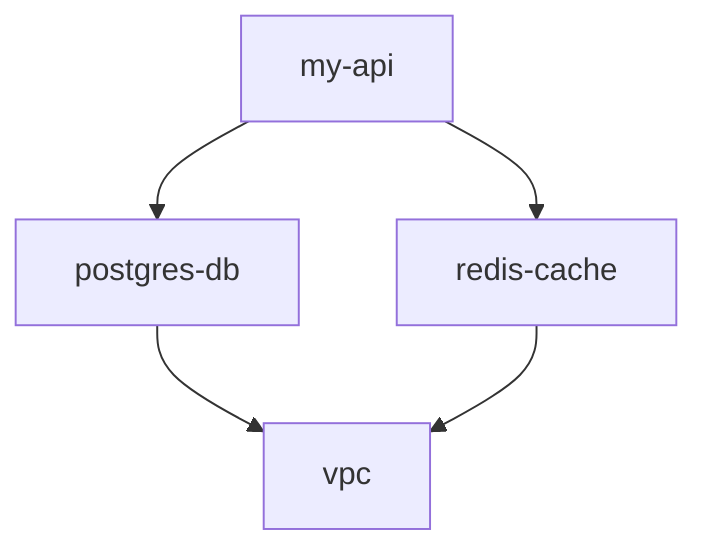

# Dependencies

PMP supports declaring dependencies between projects. When a project depends on another, operations cascade through the dependency graph in the correct order.

## Declaring Dependencies

### In Templates

```yaml
# .pmp.template.yaml
spec:
  dependencies:
    - dependency_name: database  # Optional unique identifier
      project:
        apiVersion: pmp.io/v1
        kind: PostgresDatabase
        description: "Database for the application"
        remote_state:
          data_source_name: database_state
```

### In Environment Files

```yaml
# .pmp.environment.yaml
spec:
  dependencies:
    - project:
        name: postgres-db
        environments:
          - dev
          - prod
```

## Dependency Resolution

When you run an operation on a project with dependencies:

1. PMP builds the dependency graph
2. Dependencies are processed in topological order
3. Independent projects can run in parallel
4. The target project runs last

```bash
# If my-api depends on postgres-db:
pmp project apply

# Output:
# 1. Applying postgres-db...
# 2. Applying my-api...
```

## Commands

### Visualize Graph

```bash
# ASCII tree (default)
pmp project graph

# Mermaid diagram
pmp project graph --format mermaid

# GraphViz DOT
pmp project graph --format dot

# Save to file
pmp project graph --format mermaid --output graph.mmd

# Show all projects in infrastructure
pmp project graph --all
```

**ASCII Output:**
```
my-api
├── postgres-db
│   └── vpc
└── redis-cache
    └── vpc
```

**Mermaid Output:**


### Analyze Dependencies

```bash
pmp project deps analyze
```

**Checks for:**
- Circular dependencies
- Missing dependencies
- Orphaned projects
- Dependency bottlenecks
- Standalone projects (no deps)

**Output:**
```
Dependency Analysis
==================

Statistics:
  Total projects: 12
  With dependencies: 8
  Standalone: 4
  Max depth: 3

Health:
  ✓ No circular dependencies
  ✓ All dependencies valid

Bottlenecks:
  vpc (depended on by 6 projects)
  postgres-db (depended on by 3 projects)
```

### Impact Analysis

Show what would be affected by changes to a project:

```bash
pmp project deps impact postgres-db
```

**Output:**
```
Impact Analysis: postgres-db
============================

Direct dependents:
  - my-api
  - user-service
  - auth-service

Transitive dependents:
  - api-gateway (via my-api)

Total affected: 4 projects
```

### Validate Dependencies

```bash
pmp project deps validate
```

**Checks:**
- All referenced projects exist
- No circular dependencies
- Dependency environments match

### Deployment Order

Calculate optimal deployment order:

```bash
pmp project deps order
```

**Output:**
```
Deployment Order
================

Level 1 (can deploy in parallel):
  - vpc
  - monitoring

Level 2 (after level 1):
  - postgres-db
  - redis-cache

Level 3 (after level 2):
  - my-api
  - user-service
```

### Explain Dependencies

```bash
pmp project deps why my-api
```

**Output:**
```
Dependency Explanation: my-api
==============================

my-api depends on:
  └── postgres-db
      └── vpc

Depends on my-api:
  └── api-gateway

Reason: my-api requires PostgresDatabase for data storage
```

## Remote State

When declaring dependencies, you can configure remote state data sources:

```yaml
dependencies:
  - project:
      apiVersion: pmp.io/v1
      kind: VPC
      remote_state:
        data_source_name: vpc_state
```

This generates a Terraform data source:

```hcl
data "terraform_remote_state" "vpc_state" {
  backend = "s3"
  config = {
    bucket = "terraform-state"
    key    = "vpc/dev/terraform.tfstate"
    region = "us-west-2"
  }
}

# Access outputs:
# data.terraform_remote_state.vpc_state.outputs.vpc_id
```

## Dependency-Only Projects

Use `executor: none` for projects that only group dependencies:

```yaml
# .pmp.template.yaml
spec:
  executor: none
  dependencies:
    - project:
        apiVersion: pmp.io/v1
        kind: PostgresDatabase
    - project:
        apiVersion: pmp.io/v1
        kind: RedisCache
    - project:
        apiVersion: pmp.io/v1
        kind: KubernetesWorkload
```

**Use cases:**
- Environment-wide deployments
- Feature bundles
- Staged rollouts
- Application groups

**Behavior:**
- All operations are no-ops on the group project itself
- Cascades to dependent projects
- Skipped during graph execution

## Project Groups

Pre-configure sets of projects in infrastructure:

```yaml
# .pmp.infrastructure.yaml
spec:
  projects:
    list:
      - name: full-stack
        template_pack: groups
        template: application-stack
        plugins:
          database:
            reference_projects:
              - name: postgres-db
                environment: dev
        inputs:
          app_name:
            value: "my-app"

    shared_config:
      use_all_defaults: true
```

## Best Practices

1. **Avoid circular dependencies** - Design unidirectional flows
2. **Minimize depth** - Keep dependency chains shallow
3. **Use dependency groups** - Group related projects
4. **Name dependencies** - Use `dependency_name` for clarity
5. **Document reasons** - Add descriptions to dependencies
